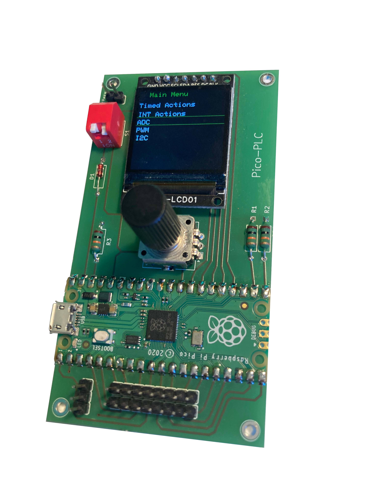
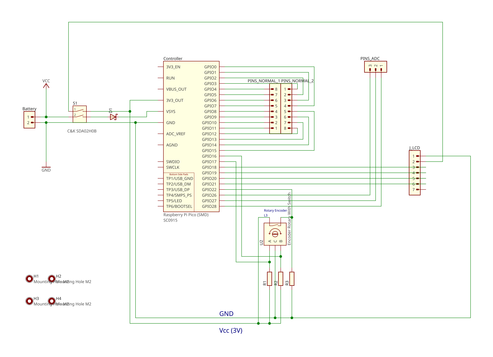
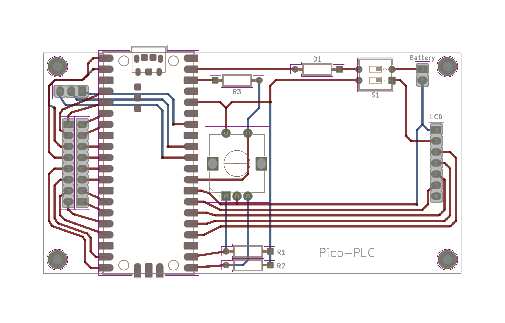

# PicoPLC 

PicoPLC is a development project which represents an extension board for the Raspberry Pi Pico (first gen). 
It is meant as a simple controller for tinkerers.
Planned features:
* Logic analyzer
* PWM generation
* Protocol based actions (mainly I²C, SPI, UART)
* Actions based on:
  * ADC
  * Interrupts
  * Timings

Currently just a HW draft and a basic SW-layer has been accomplished. The build system is based on
PlatformIO but will be replaced with CMake eventually.

# Hardware

The schematics and footprint has been created with <a href="https://librepcb.org/"> LibrePCB </a>. For 
production <a href="https://aisler.net/de"> Aisler </a> has been chosen.
The bottom left sided 3 pin jack is connected to the Pico's ADC. The 2x8 pin jack could be used for future extension 
boards (e.g.: buttons, sensors, LoRa, IR, ...). The two pins located over the red switch are used to power 
the board using a battery (Important: Do not use without charge controller circuit! Link is below.).

## Schematic

## Footprint

# Components

## Essential:

* µC-Board: https://www.reichelt.de/de/de/shop/produkt/raspberry_pi_pico_rp2040_cortex-m0_microusb-295706
* Display: https://www.reichelt.de/de/de/shop/produkt/entwicklerboards_-_display_lcd_1_3_240_x_240_pixel_st7789-296742
* Encoder: https://www.reichelt.de/de/de/shop/produkt/drehimpulsegeber_24_impulse_24_rastungen_vertikal-73923
* Stiftleisten (Pins): https://www.reichelt.de/de/de/shop/produkt/stiftleiste_2x10-polig_vergoldet_2_54-235636#closemodal
* Schalter: https://www.reichelt.de/de/de/shop/produkt/piano-dip-schalter_2-polig-36468
* Schottky-Diode: https://www.reichelt.de/de/de/shop/produkt/schottkydiode_40_v_0_35_a_do-35-4855
* 10 kΩ Widerstand: https://www.reichelt.de/de/de/shop/produkt/widerstand_metalloxyd_10_kohm_0207_1_0_w_5_-1779

## Battery extension:

* Laderegler: https://www.az-delivery.de/products/az-delivery-laderegler-tp4056-micro-usb?_pos=2&_sid=d151976ab&_ss=r
* Akku: https://www.reichelt.de/de/de/shop/produkt/li-ion_akku_soldered_333278_500_mah_3_7_v-373542

## Future improvements:

* MOSFET: https://www.reichelt.de/de/de/shop/produkt/mosfet_p-ch_-60v_-18_7a_0_13r_to-220-257465